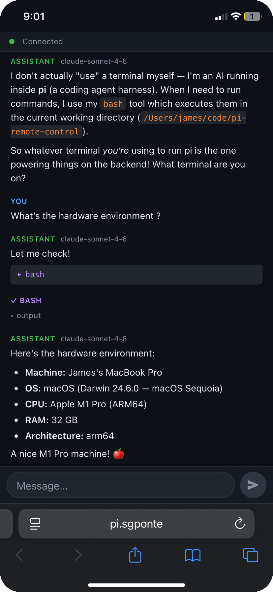

# pi-remote-control

## Disclaimer

This project is for personal use and research only. It is provided as-is, and the author accepts no liability for any damage, loss, misuse, or operational consequences that result from installing or using it. The server has no built-in authentication beyond a session token and no HTTPS on the dynamic port — see [Security notes](#security-notes) for details. Do not use it for safety-critical, multi-user, or untrusted-network deployments.

## Install

```bash
pi install https://github.com/goofansu/pi-remote-control
```

## Usage

Run `/remote-control` to open the menu:

- **Turn on / Turn off** — start or stop the server
- **Configure URL** — set the base URL exposed by your local tunnel or proxy, saved to `~/.pi/agent/remote-control.json`
- **Status** — show the QR code and connection URL (only when server is running)

> **Note:** On first use, you must configure the URL before the server can start.

To start the server automatically on launch:

```bash
pi --remote-control
```

## Use case

The remote-control server binds to `127.0.0.1` on the host running `pi` and is reached through a local tunnel or proxy. This example uses [Surge Ponte](https://kb.nssurge.com/surge-knowledge-base/guidelines/ponte), which provides an end-to-end encrypted device-to-device tunnel without exposing the server to the LAN.

The setup is:

1. Install this extension on the Mac that runs `pi`.
2. Enable Surge Ponte on that Mac and give it a device name such as `pi`.
3. On the same Mac, open `pi` and run the `/remote-control` command.
4. Choose `Configure URL` and set the base URL to your Surge Ponte hostname, for example `http://pi.sgponte`.
5. Choose `Turn on`.
6. Open `Status` to get the QR code and connection URL for the current session.
7. On another device on the same Surge Ponte network, open that URL in a browser.

In this setup, the browser URL is `http://pi.sgponte:<port>`, where the port is assigned when the server starts. Use `Status` to get the current URL or scan the QR code — it changes each time the server restarts.

Here's what it looks like on iPhone — this is an actual session asking `pi` about its hardware environment:



## Security notes

- The server only listens on localhost. Remote access depends on whatever local tunnel or proxy you configure.
- There is no multi-user authentication. Treat the connection URL as a secret for the lifetime of the session.
- If you use a reverse proxy instead of Surge Ponte, configure it to terminate TLS at a fixed `https://` endpoint and forward to the server's dynamic backend port. Do not expose the dynamic port directly over a public network, as the server does not support HTTPS and any token or session cookie would be transmitted in cleartext.
