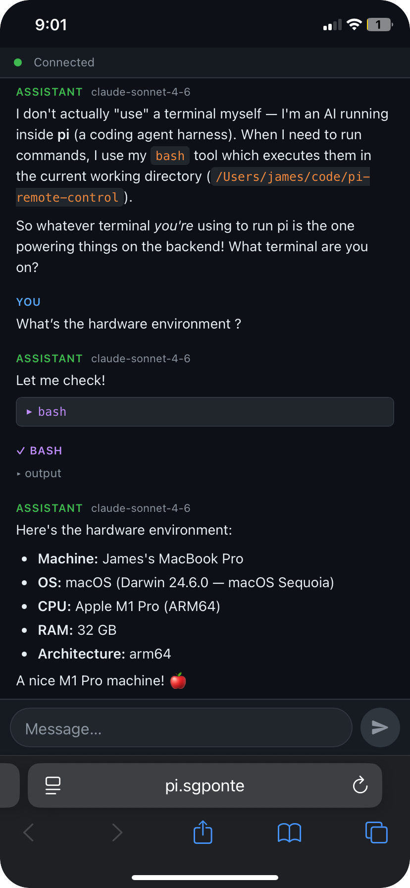

# pi-remote-control

## Disclaimer

This project is for personal use and research only. It is provided as-is, and the author accepts no liability for any damage, loss, misuse, or operational consequences that result from installing or using it. The server has no built-in authentication beyond a session token and no HTTPS on the dynamic port — see [Security notes](#security-notes) for details. Do not use it for safety-critical, multi-user, or untrusted-network deployments.

## Install

```bash
pi install https://github.com/goofansu/pi-remote-control
```

## Usage

Run `/remote-control` to open the menu:

- **Turn on / Turn off** — start or stop the server
- **Configure URL** — set the base URL other devices use to reach this machine (its Tailscale address), saved to `~/.pi/agent/remote-control.json`
- **Status** — show the QR code and connection URL (only when server is running)

> **Note:** On first use, you must configure the URL before the server can start.

To start the server automatically on launch:

```bash
pi --remote-control
```

## Use case

The remote-control server runs on the host running `pi` and is reached directly over [Tailscale](https://tailscale.com) — no tunnel or proxy in between. Tailscale gives every device on your tailnet a stable, private, end-to-end encrypted address (a `100.x.y.z` IP, or a `machine.tailnet.ts.net` name if MagicDNS is enabled), so the guest device connects straight to the host.

The setup is:

1. Install this extension on the Mac that runs `pi`.
2. Install Tailscale on that Mac and on the device you'll connect from, and sign both into the same tailnet.
3. On the Mac, find its Tailscale address with `tailscale ip -4` (or use its MagicDNS name).
4. Open `pi` on the Mac and run the `/remote-control` command.
5. Choose `Configure URL` and set the base URL to that Tailscale address, for example `http://100.101.102.103` or `http://your-machine.tailnet.ts.net`.
6. Choose `Turn on`.
7. Open `Status` to get the QR code and connection URL for the current session.
8. On the other device (also on the tailnet), open that URL in a browser.

In this setup, the browser URL is `http://<tailscale-address>:<port>`, where the port is assigned when the server starts. Use `Status` to get the current URL or scan the QR code — it changes each time the server restarts.

Here's what it looks like on iPhone — this is an actual session asking `pi` about its hardware environment:



## Security notes

- The server listens on all interfaces (`0.0.0.0`) so it is reachable over the Tailscale interface. Keep access constrained to your tailnet — do not run this on a machine whose LAN or public interfaces you do not trust, and consider Tailscale ACLs to limit which devices can reach the port. If you need strict localhost-only binding, revert the listen host in `extensions/remote-control/server.ts`.
- There is no multi-user authentication. Treat the connection URL as a secret for the lifetime of the session.
- Traffic between tailnet devices is end-to-end encrypted by Tailscale. The server itself does not terminate TLS, so do not expose the dynamic port directly over a public network — any token or session cookie would be transmitted in cleartext outside the tailnet.
