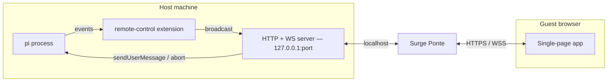
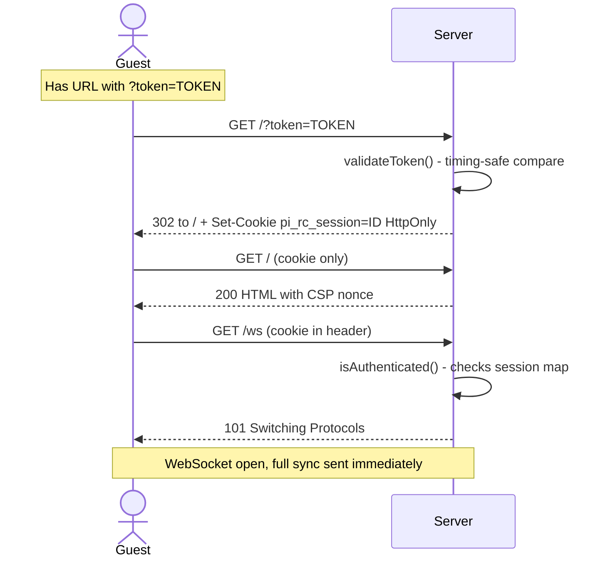
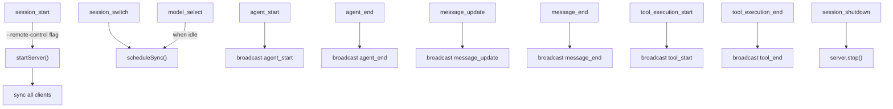

# Architecture

## Overview

`pi-remote-control` is a pi extension that exposes a running pi session over
HTTP/WebSocket. The machine running pi is the **host**; any browser that
connects is a **guest**.

The server binds to `127.0.0.1` only (never the LAN). A local proxy or tunnel
(e.g. Surge Ponte) forwards external traffic to it. The guest interacts
through a self-contained single-page app served inline — no CDN, no external
assets.



## Files

| File | Purpose |
|------|---------|
| `extensions/pi-remote-control/index.ts` | Extension entry point — registers flag, command, and event bridge |
| `extensions/pi-remote-control/server.ts` | HTTP + WebSocket server, auth enforcement, client management |
| `extensions/pi-remote-control/messages.ts` | Wire protocol: serialize session entries → `RenderMsg`, build `sync` payloads |
| `extensions/pi-remote-control/html.ts` | Inline single-page web UI (self-contained, no external deps) |
| `extensions/pi-remote-control/auth.ts` | One-time token generation/validation, session cookie helpers |
| `extensions/pi-remote-control/config.ts` | Read/write `remote-control.json`, public URL normalization and config UI |

## Authentication Flow

First-visit authentication exchanges the one-time token for a 24-hour session
cookie, keeping the token out of browser history and subsequent requests.
Note that the initial `GET /?token=TOKEN` may still be recorded by any proxy
or tunnel sitting in front of the server before the 302 redirect issues the cookie.



**Security headers on every HTML response:**
- `Content-Security-Policy` with a per-request nonce (no `unsafe-inline`)
- `X-Frame-Options: DENY`
- `X-Content-Type-Options: nosniff`
- `Referrer-Policy: no-referrer`

## Wire Protocol (WebSocket)

### Host → Guest

| Message type | Payload fields | When sent |
|---|---|---|
| `sync` | `messages[]`, `state` (`isStreaming`, `model`, `cwd`, `sessionName`) | On connect, session switch, model change |
| `message_update` | `message: RenderMsg` | Streaming assistant turn (partial) |
| `message_end` | `message: RenderMsg` | Assistant turn finalized |
| `tool_start` | `toolCallId`, `toolName`, `args` | Tool execution begins |
| `tool_end` | `toolCallId`, `result`, `isError` | Tool execution completes |
| `agent_start` | — | Agent turn starts |
| `agent_end` | — | Agent turn ends |
| `status` | `clientCount` | Client disconnects |

### Guest → Host

| Message type | Payload | Effect |
|---|---|---|
| `prompt` | `text: string` | `pi.sendUserMessage(text)` — as normal message when idle, as follow-up when busy |
| `stop` | — | `ctx.abort()` — cancels the current agent turn |

**Per-connection server-side rate limit:** max 30 prompt messages per 60-second
sliding window; messages over 64 KB are silently dropped. The limit applies
per WebSocket connection — opening multiple connections multiplies it.

### RenderMsg shape

```typescript
interface RenderMsg {
  id: string;               // SessionEntry id, or "pending" while streaming
  role: "user" | "assistant" | "tool_result";
  text: string;
  toolCalls?: Array<{ id: string; name: string; args: string }>;
  toolName?: string;        // tool_result only
  toolCallId?: string;      // tool_result only
  isError?: boolean;        // tool_result only
  model?: string;           // assistant only
}
```

## Session Lifecycle Events




